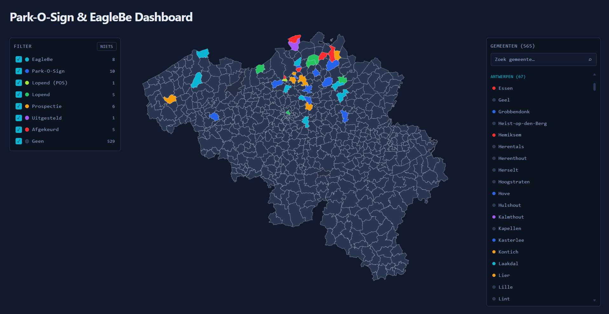

# POS / EagleBe Gemeenten Dashboard

Standalone internal dashboard showing, per Belgian gemeente, whether it is a
Park-O-Sign (POS) klant, has EagleBe actief, and where it sits in the sales
pipeline — rendered as a colored map of Belgium. Municipalities can be edited
in place; changes are written straight to the database.

## Preview



## Stack

| Part      | Tech                                                                        |
|-----------|----------------------------------------------------------------------------  |
| Frontend  | React 19 + TypeScript, Vite, Tailwind CSS v4, `@vnedyalk0v/react19-simple-maps` |
| Backend   | ASP.NET Core (.NET 10) Web API, EF Core + SQLite                             |
| Import    | Python (`pandas` + `openpyxl`) one-shot Excel → SQLite loader               |

## Repository layout

```
backend/PosDashbaord.Api/        ASP.NET Core API (controllers, EF Core model, SQLite)
frontend/                        Vite React app
frontend/src/components/         Map, LegendFilter, MunicipalityBrowser, MunicipalityPanel
frontend/src/lib/categories.ts   Category (colour) derivation from setup + status
frontend/src/data/belgium.json   TopoJSON of Belgian municipalities (map + NIS lookup)
scripts/import_excel.py          Excel → SQLite reseed script
```

## Running locally

### 1. Backend

```bash
cd backend/PosDashbaord.Api
dotnet run
```

Serves on `http://localhost:5093`. `EnsureCreated()` creates
`data/dashboard.db` on first run if it does not exist. CORS is open to the Vite
dev server at `http://localhost:5173`.

### 2. Seed the database

The map is empty until the Excel export is imported:

```bash
pip install pandas openpyxl
python scripts/import_excel.py \
  path/to/Belgische_gemeenten_dashboard_POS_EagleBe.xlsx \
  backend/PosDashbaord.Api/data/dashboard.db \
  frontend/src/data/belgium.json
```

This **drops and recreates** the `Municipalities` table every run and reloads
it from the Excel file — it is a reseed, not a merge. While the Excel is the
source of truth, any `Status` / `Setup` edits made through the app are
overwritten on re-run. It also matches each gemeente to its RefnisCode (NIS
code) against `belgium.json`; unmatched names are reported at the end and can be
fixed via `MANUAL_ALIASES` in the script.

### 3. Frontend

```bash
cd frontend
npm install
npm run dev
```

Opens on `http://localhost:5173`. The API base URL is hardcoded in
`frontend/src/api/client.ts`.

## API

Base: `http://localhost:5093/api`

| Method | Route                     | Body                          | Description                                     |
|--------|---------------------------|-------------------------------|------------------------------------------------|
| GET    | `/municipalities`         | —                             | All municipalities                             |
| POST   | `/municipalities/{id}`    | `{ setup, status }`           | Update one; returns the updated row, `404` if unknown id |

`setup` is one of `Geen` / `Park-O-Sign` / `EagleBe`. The controller derives
`isPosCustomer` / `isEagleBeActive` from it and stamps `lastUpdated` (UTC,
`"yyyy-MM-dd HH:mm:ss"`). `status` is the pipeline state: `""`, `Prospectie`,
`Afgekeurd`, `Uitgesteld`, `Lopend`, `Order`.

## Data model

`Municipality`: `id`, `name`, `refnisCode`, `region`, `province`,
`postalCodes` (`int[]`, stored as JSON via an EF value converter), `setup`,
`status`, `isPosCustomer`, `isEagleBeActive`, `lastUpdated`.

## Frontend behaviour

- **Map** — each gemeente is filled by its category colour (see
  `lib/categories.ts`): pipeline status first (`Afgekeurd`, `Prospectie`,
  `Uitgesteld`, `Lopend` / `Lopend (POS)`), otherwise product (`EagleBe`,
  `Park-O-Sign`, `Geen`). Click a gemeente to select it (white outline); click
  empty space to deselect.
- **Filter** (left panel) — one checkbox per category with live counts, plus an
  **Alles / Niets** toggle. Unchecking a category dims those gemeenten to the
  `Geen` colour on the map (still clickable) and drops them from the list.
- **Gemeenten** (right panel) — full list grouped by province with counts and a
  search box that filters by name. Hovering a row highlights that gemeente on
  the map; clicking selects it.
- **Gemeente panel** — edit `Setup` and `Status`; **Opslaan** POSTs the change,
  which updates the map and the database. `Esc` or **×** closes it.
